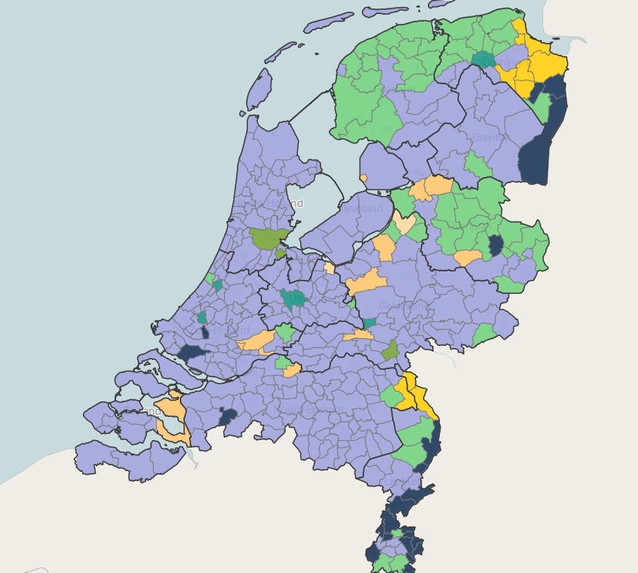

```{r setup, include=FALSE}
knitr::opts_chunk$set(echo = TRUE, tidy= TRUE, tidy.opts = list(comment = FALSE),
  dev.args = list(bg = 'transparent'),
  fig.align = "center",
  fig.pos = "H")


library("tidyverse")
library("car")
library(reshape2)
library(lindia)
library("GGally")
library("Hmisc")
library("lattice")
library("survival")
library("formatR")
#library("kableExtra")
library("knitr")
library(faraway)

#options(kableExtra.latex.load_packages = FALSE)

rm(list = ls()) # empty work space
Data_CDA <- read.csv("1_clean_data/Clean_data_CDA_2018-12-21.csv",
                 stringsAsFactors=F, header = T)

# Remove Non_west for now. We later add it again
Data_CDA <- Data_CDA %>%
  select(-Non_west)

```

# Abstract
For this report demographics of Dutch municipalities are compared with the results of the general Dutch election of 2017. The demographic variables are the *Urban index*, the *fraction of highly educated residents*, *Mean income*, *fraction of 60 plus residents* in a municipality and the factor *Non western*. This factor devides municipalities in the once with less than 5%, 5-10% and more than 10% Non-western residents.

This research focusses on the results for party CDA. The goal is to find voting trends per demographic group and to make future predictions for CDA. This goal is approached with two different models. The first is a linear model with a log transformation of the respons. The cross validation resulted in a Mean Squared Error (MSE) of 0.058. The second, is a binomial model with the logit as link function. The found MSE is 0.0017.

It is difficult to say which model fits the data better, because they have different significant variables. Furthermore both have their limitations and the data showed a large overdispersion. It is not likely that predictions for future elections can be made with these models. 

# 1. Introduction 


## 1.1 Motivation

For this case study, it was decided to combine the outcome from the Dutch elections of 2017 and demographic data. Both are collected per municipality and are well maintained and reliable.  This will hopefully result in observing voting trends per demographic group. The final goal is to validate the model for making future predictions.

{width=250px}

**Dutch political parties**   
This figure displays the diffences between the political parties in the Netherlands. The Netherlands has a total of 13 parties. This investigation focusses on only one party. This party should not be to extreme left/right/conservative/progressive and should also be one of the bigger parties. Otherwise, there is not enough data available, making the results less reliable. Therefore, party CDA is chosen. 

In this research the above described demographics are chosen because of their influence on a municipality level. The expectation is that a municipality with more non-western residents for example votes different than a municipality with less non-western residents. This is the same for the other two demographics. Other demographics are also researched, for example gender, but on a municipality level there is no large difference between the amount of men and women per municipality. So that is a more interesting demographic to research on an individual level. 
*The standardized income per municipality* are given in thousands. *Urban index* of a municipality is a database with five categories per municipality. These five categories are: 

\begin{itemize}
\item 0. No urbanity (less than 500 addresses per $km^2$)
\item 1. Little urbanity (500-1000 addresses per $km^2$)
\item 2. Moderate urbanity (1000- 1500 addresses per $km^2$)
\item 3. Strong urbanity (1500-2500 addresses per $km^2$) 
\item 4. Really strong urbanity (more than 2500 addresses per $km^2$)
\end{itemize}

Per municipality the amount of $km^2$ per category is given. The *non-west residents per municipality* is given as an amount per municipality, also the total amount of residents is given per municipality. 


## 1.2 Data sources

**Electoral data**
For the electoral data, the results of the 2017 general election are used. This is the most recent national election and is of the most important election type in the Netherlands. Furthermore, it had a turnup of 81.9%. Therefore, it seems plausible that the data for this election is representative of the political makeup of different municipalities. We downloaded the raw data directly from the official government source.^[https://data.overheid.nl/data/dataset/verkiezingsuitslag-tweede-kamer-2017] This contained a .csv file with the raw number of votes for every party in every municipality. 


**Demographical data**  
We got our demographical data from the CBS, the official Dutch statistical agency.^[https://opendata.cbs.nl/statline/#/CBS/nl/dataset/70072ned/table?ts=1544803364892] From the wealth of demographical information available we picked a handful of attributes that we suspected (based on prior research and some gut feeling) to be useful as predictor variables. We landed on five demographical attributes: education grade, average income, age, urbanization and the amount of people with a non-western background. Note that the data we downloaded from the CBS site usually had to be transformed to get it in a useful predictor variable format. The specifics of these are described in the next section.


## 1.3 Data cleaning 

An extensive amount of data cleaning had to be done. Below these steps are describes and a small part of code is displayed.

**Electoral data**  


.... write something here....


**Demographical data**  


The variable *non-western residents* are divided in three groups:

\begin{itemize}
\item Municipalities with less than 5 % non-western residents 
\item Municipalities with 5-10 % non-western resident 
\item Municipalities with mre than 10 % non-western residents
\end{itemize}


At last, the electoral data and demographic data are combined again. Only the municipality Boxmeer is removed, due to a mistake not all the votes are reported here^[https://www.gelderlander.nl/boxmeer/7-600-stemmen-in-boxmeer-niet-meegenomen-in-uitslag-verkiezingen~a063ee9e/]. The final dataset has no NAs

```{r}
summary(Data_CDA)
```


## 1.3 Data visualisation

In this part the cleaned data is visualized, so that a good picture can be obtained of the current data. First of all some demographics of data will be showed. In figure \ref{1} of the *parties*, *the urban index*, *the percentage of highly educated residents*, *the mean income*, *The non west residents factor* and * the percentage 60 plus* are plotted. 
As you can see in the plot, they are normal distributed. Because of the low values at the x-axis, the CDA, GroenLinks, 60 plus percentage and the highly educated densities are above 1. The area beneath the curve sums to 1, so it is correct.

```{r demographics, echo=FALSE}
#knitr::kable(
#  summary(Data_CDA[,-1], digits=2), caption="Data summary", "latex",booktabs = T) %>% kable_styling(latex_options=c("scale_down", "striped"), bootstrap_options = "hover")
```

```{r demographics_data, echo=FALSE, warning=FALSE,message=FALSE,error=FALSE, fig.cap="\\label{1} Density plot" , fig.width=10, fig.height=4}
#### Demographics of data ####

dens = ggplot(melt(Data_CDA[,c(2:9)]), aes(x = value)) + 
  facet_wrap(~ variable, scales = "free", ncol = 2) + 
  geom_histogram(aes(y=..density..), position="identity", alpha=0.5)+
  geom_density(alpha=0.4, aes(fill = "red", col = "red"))+
  theme(legend.position="none")

plot(dens)
```


**Correlation heatmap**
In this heatmap (figure \ref{2}) the correlation between explanatory and respons variable are showed. The red color means a positive relation, the purple color means a negative relation. The non_west variable is not taken into account, because it is a factor and the other variables are continous. 


```{r correlation_heatmap, echo=FALSE, warning=FALSE,message=FALSE,error=FALSE, fig.cap= '\\label{2}Correlation between explanatory and respons variables', fig.width=5, fig.height=3}
# Heatmap of the correlations
heatmap = ggcorr(Data_CDA[,c(2:9)], 
                 low = "darkblue", mid = "lightyellow", high = "red",
                 label = T, label_size = 2.5, label_round = 3,   
                 color = 'black', size = 4, layout.exp = 2, hjust = 1) 

plot(heatmap)

```

```{r  echo=FALSE, warning=FALSE,message=FALSE,error=FALSE, fig.cap= "Votes for CDA per municipality", fig.width=5, fig.height=3}
p1 <- ggplot(Data_CDA, aes(x = Non_west, y = CDA_frac, fill = Non_west)) + 
       geom_boxplot(outlier.colour="black", 
                    outlier.size=2, 
                    outlier.fill =  "red",
                    na.rm = F,
                    color = "black") +
       xlab("Non-western residents") +
       ylab("Votes for CDA") +
       scale_x_discrete(labels = c("< 5%", "5-10%", "> 10 %")) +
       guides(fill = F)

#plot(p1)
```


```{r  echo=FALSE, warning=FALSE,message=FALSE,error=FALSE, fig.cap= "Urbanity index against non-western residents" , fig.width=5, fig.height=3}

p2 <- ggplot(Data_CDA, 
             aes(x = Non_west, y = Urban_index, fill = Non_west)) + 
  geom_boxplot(outlier.colour="black", 
               outlier.size=2, 
               outlier.fill =  "red",
               na.rm = F,
               color ="black") +
  #ggtitle("Urbanity index against non-western residents") +
  xlab("Non-western residents") +
  ylab("Urbanity index") +
  ylim(c(0,4)) +
  scale_x_discrete(labels = c("< 5%", "5-10%", "> 10 %")) +
  guides(fill = F)
 

#plot(p2)
```


```{r boxplots_code, echo=FALSE, warning=FALSE,message=FALSE,error=FALSE}
# Linear regression between votes for CDA and mean income
Euro <- "\u20AC" # euro sign

p3 <- ggplot(Data_CDA, aes(x=Mean_income, y=CDA_frac)) + 
  geom_point() + 
  geom_smooth(method=lm, se = T) +
  xlab(paste("Mean income per municipality ")) +
  ylab("Votes for CDA") +
  ylim(c(0,0.45)) +
  xlim(c(20,42)) 

#plot(p3) 


p4 <- ggplot(Data_CDA, aes(x=Mean_income, y=High_educated_frac)) + 
  geom_point() + 
  geom_smooth(method=lm, se = T) + # standard error = True
  ##ggtitle("Highly educated residents and mean income per municipality ") +
  xlab(paste("Mean income (x ",Euro, " 1000)", sep = "")) +
  ylab("Highly educated residents") +
  xlim(c(20,42)) 

#plot(p4)

# Urbanity index and highly educated residents
p5 <- ggplot(Data_CDA, aes(x=Urban_index, y=High_educated_frac)) + 
  geom_point() + 
  geom_smooth(method=lm, se = T) + # standard error = True
  ##ggtitle("Highly educated residents and urbanity index") +
  xlab("Urbanity index") +
  ylab("Highly educated residents") +
  xlim(c(0,4))


#plot(p5)


# Urbanity index and CDA votes
p6 <- ggplot(Data_CDA, aes(x=Urban_index, y=CDA_frac)) + 
  geom_point() + 
  geom_smooth(method=lm, se = T) + 
  xlab("Urbanity index") +
  ylab("Votes for CDA") +
  xlim(c(0,4.1)) +
  ylim(c(0,0.45))


p9 <- ggplot(Data_CDA, aes(x=Urban_index, y=Frac_60plus)) + 
  geom_point() + 
  geom_smooth(method=lm, se = T)  +
  xlab("Urbanity index") +
  ylab("> 60 years old residents") +
  xlim(c(0, 4)) +
  ylim(c(0,0.20))# + 


```


```{r, include=FALSE}

# Function to plot multiple plots together
multiplot <- function(..., plotlist=NULL, file, cols=2, layout=NULL) {
  library(grid)
  
  # Make a list from the ... arguments and plotlist
  plots <- c(list(...), plotlist)
  
  numPlots = length(plots)
  
  # If layout is NULL, then use 'cols' to determine layout
  if (is.null(layout)) {
    # Make the panel
    # ncol: Number of columns of plots
    # nrow: Number of rows needed, calculated from # of cols
    layout <- matrix(seq(1, cols * ceiling(numPlots/cols)),
                     ncol = cols, nrow = ceiling(numPlots/cols))
  }
  
  if (numPlots==1) {
    print(plots[[1]])
    
  } else {
    # Set up the page
    grid.newpage()
    pushViewport(viewport(layout = grid.layout(nrow(layout), ncol(layout))))
    
    # Make each plot, in the correct location
    for (i in 1:numPlots) {
      # Get the i,j matrix positions of the regions that contain this subplot
      matchidx <- as.data.frame(which(layout == i, arr.ind = TRUE))
      
      print(plots[[i]], vp = viewport(layout.pos.row = matchidx$row,
                                      layout.pos.col = matchidx$col))
    }
  }
}
```

**Multilineair plots CDA **
In these two plots you can see a scatterplot with on the y-axis the votes for CDA in percentages and on the x-axis on the left graph the mean income per municipality in 1000 euro. The right plot has the urbanity index as x-axis. As you can see, the trend is that when the mean income goes up, the votes for CDA goes down. Same with the urbanity index. In the model formulation graph these trends are checked. 
```{r, echo=FALSE, warning=FALSE,message=FALSE,error=FALSE, fig.cap= "\\label{3}Scatterplots CDA", fig.width=5, fig.height=3}
multi_linearCDA <- multiplot(p3, p6)

```


**Exploratory plots of variables**
These three plots are scatterplots of the explanatory variables. 
```{r, echo=FALSE, warning=FALSE,message=FALSE,error=FALSE, fig.width=5, fig.height=3, fig.cap= "\\label{5}Scatterplot explanatory variables"}
multi_linear <- multiplot(p4, p5)
plot(p9)

```

**Multiple boxplots**
In this graph boxplots are made, to compare some variables. A boxplot is a standardized way to display the distribution of data. It gives the minimum, first quartile, median, third quartile and the maximum. If there are any outliers, the boxplot is extended with those. The line within the box is the median, the first and third quartile are the down- and upside of the box, respectively. The length of the box is the Inter Quartile Range (IQR). The minimum and maximum are 1.5X Inter Quartile Range (IQR). Observations further away can be considered outliers.

```{r, echo=FALSE, warning=FALSE,message=FALSE,error=FALSE, fig.width=5, fig.height=3, fig.cap= "\\label{6}Three boxplots: Votes for CDA, Votes for GroenLinks and Urbanity index"}

multiplot(p1, p2)

```


# 2. Multiple linear regression
In this chapter multiple linear models are generated. The demographics tested in this model are the highly educated fraction in a municipality `High_educated_frac`, the urban index of a municipality `Urban_index`, the mean income of the municipality `Mean_income`, the non-west factor `Non_west` and the fraction that is 60 plus in the municipality `Frac_60plus`. 
The error assumptions are also discussed. This are assumptions made for the residuals, to check if meet the requirements for correct linear regressions. These assumptions are: 
* Linearity: The expected value of the error is zero
* Constant variance: The variance of the error is constant 
* Normality: The errors are normally distributed
* Indepence: The observations are sampled indipendently


## First model
 The first model will be the model with all the demographics:  
$Y_i = \beta_0 + 	\beta_1*high educated fraction + \beta_2*Urban index + \beta_3*Mean income + \beta_4*Non west2 +\beta_5*Non west3 + \beta_6*Frac 60plus + \epsilon i$   
The outcome of this model is shown below: 
\begin{table}[ht]
\centering
\begin{tabular}{rrrrr}
  \hline
 & Estimate & Std. Error & t value & Pr() \\ 
  \hline
(Intercept) & 0.3381 & 0.0314 & 10.78 & 0.0000 \\ 
  High\_educated\_frac & -0.0864 & 0.0454 & -1.90 & 0.0576 \\ 
  Urban\_index & -0.0193 & 0.0041 & -4.69 & 0.0000 \\ 
  Mean\_income & -0.0015 & 0.0011 & -1.46 & 0.1453 \\ 
  Non\_west2 & -0.0223 & 0.0065 & -3.45 & 0.0006 \\ 
  Non\_west3 & -0.0455 & 0.0095 & -4.77 & 0.0000 \\ 
  Frac\_60plus & -0.5904 & 0.1494 & -3.95 & 0.0001 \\ 
   \hline
\end{tabular}
\end{table}

The first model is the total model, `high_educated_frac` and `Mean_income` do not have a significant t-value. Before any conclusions are made, the assumptions are checked via plots and the VIF is checked. The VIF is the Variation Inflation Factor, it implies if there is multicollinearity between two or more variables. The formula for VIF is $1/(1-R^2)$ and the thresholdvalue is 10. So values above 10 give signs of multicollinearity. As shown below none of the values are above 10, so no signs of collinearity. 
```{r LM_VIFcheck, warning=FALSE,message=FALSE,error=FALSE, echo=FALSE}
lm_CDA_1 <- lm(CDA_frac ~ High_educated_frac +  Urban_index+
               Mean_income +Non_west + Frac_60plus,data = Data_CDA)
vif(lm_CDA_1)
#xtable(summary(lm_CDA_1))
```
```{r, echo=FALSE, warning=FALSE,message=FALSE,error=FALSE, fig.width=12, fig.height=3, fig.cap= "\\label{afm}assumptions first model"}
par(mfrow = c(1,4))
plot(lm_CDA_1, which = 1, id.n = 5) # we see heterogenitiy of variance
qqPlot(lm_CDA_1) # right tail is skewed (non normality)

plot(lm_CDA_1, which = 3, id.n = 5) # var of error not equal, non-linearity, obs 300 & 76 outliers
plot(lm_CDA_1, which = 4, id.n = 5)# cutt off val: 0.011. Everything above cut-off is at least influencal point, maybe outlier
abline(h = 0.011, col = "red")

```

In figure \ref{afm} the four plots are shown. The first plot (Residuals vs Fitted) shows that the residuals have a 'loudspeaker pattern', the variance of the residuals tends to increase with an increase of the fitted value. Because of this, a BoxCox graph is consulted. This graph suggests a transformation for the response. The BoxCos figure \ref{BC1} in has a 95% Confidence interval located around the 0. So a ln transformation is suggested. 
```{r, echo=FALSE, warning=FALSE,message=FALSE,error=FALSE, fig.width=5, fig.height=3, fig.cap= "\\label{BC1}BoxCox first model"}
gg_boxcox(lm_CDA_1)

```
## Second model
In the second model the response variable will be ln transformed. So the new model will be:  
$ln(Y_i) = \beta_0 + 	\beta_1*high educated fraction + \beta_2*Urban index + \beta_3*Mean income + \beta_4*Non west2 + \beta_5*Non west 3 + \beta_6*Frac 60plus + \epsilon i$ 
\begin{table}[ht]
\centering
\begin{tabular}{rrrrr}
  \hline
 & Estimate & Std. Error & t value & Pr() \\ 
  \hline
(Intercept) & -0.9944 & 0.1882 & -5.28 & 0.0000 \\ 
  High\_educated\_frac & -0.8808 & 0.2723 & -3.24 & 0.0013 \\ 
  Urban\_index & -0.1388 & 0.0247 & -5.62 & 0.0000 \\ 
  Mean\_income & -0.0024 & 0.0064 & -0.38 & 0.7042 \\ 
  Non\_west2 & -0.0991 & 0.0389 & -2.55 & 0.0112 \\ 
  Non\_west3 & -0.2763 & 0.0572 & -4.83 & 0.0000 \\ 
  Frac\_60plus & -2.6940 & 0.8965 & -3.01 & 0.0028 \\ 
   \hline
\end{tabular}
\end{table}


```{r, echo=FALSE, warning=FALSE,message=FALSE,error=FALSE, fig.width=12, fig.height=3, fig.cap= "\\label{asm}assumptions second model"}
lm_CDA_2 <- lm(log(CDA_frac) ~ High_educated_frac +  Urban_index+
                 Mean_income +Non_west + Frac_60plus,data = Data_CDA)
#xtable(summary(lm_CDA_2))
# Check assumptions
par(mfrow = c(1,4))
plot(lm_CDA_2, which = 1) # still heteroscadacity, 
qqPlot(lm_CDA_2) # normally distributed
plot(lm_CDA_2, which = 3) # both the fitted and residuals are more spread out
plot(lm_CDA_2, which = 4)  # only obs 16(amsterdam) is influential. 
# Cutoff val for Cooks: 4 / (369 - 5 - 1) = 0.011
```
The plots in figure \ref{asm} show one big outlier, the municipality Amsterdam which has number 16. Amsterdams value for the cooks distance goes way above the cutoff value for cooks, $4/(369-5-1)=0.011$. It is also outside the (-3,3) range with the studentized residuals. That is why this municipality is removed.   
For the second model without Amsterdam, a step function is used. This step function uses the AIC for backward elimination. If the AIC can get lower, because a variable is removed that variable will be removed else no variable is removed.  The formula for AIC is $AIC=-2log(likelihood)+2p$, p is the number of parameters in the model. The variables that are left are the variables used in the final model. 

```{r, echo=FALSE, warning=FALSE,message=FALSE,error=FALSE}
lm_CDA_2a <-lm(log(CDA_frac) ~ High_educated_frac +  Urban_index+
                 Mean_income +Non_west + Frac_60plus,data = Data_CDA[-16,])
step(lm_CDA_2a)
```

## Final model
The backward elimination resulted in the final model.  
$ln(Y_i) = \beta_0 + 	\beta_1*high educated fraction + \beta_2*Urban index +  \beta_4*Non west2 + \beta_5*Non west 3 + \beta_6*Frac 60plus + \epsilon_i$ 
The coëfficients are given in the table below
```{r demographics_data1, echo=FALSE}
lm_CDA_final <-lm(log(CDA_frac) ~ High_educated_frac +  Urban_index +Non_west + Frac_60plus,data = Data_CDA[-16,])

```
\begin{table}[ht]
\centering
\begin{tabular}{rrrrr}
  \hline
 & Estimate & Std. Error & t value & Pr($>$$|$t$|$) \\ 
  \hline
(Intercept) & -1.0298 & 0.1365 & -7.54 & 0.0000 \\ 
  High\_educated\_frac & -0.8277 & 0.2129 & -3.89 & 0.0001 \\ 
  Urban\_index & -0.1311 & 0.0240 & -5.46 & 0.0000 \\ 
  Non\_west2 & -0.1141 & 0.0378 & -3.02 & 0.0027 \\ 
  Non\_west3 & -0.2871 & 0.0559 & -5.13 & 0.0000 \\ 
  Frac\_60plus & -3.0168 & 0.8799 & -3.43 & 0.0007 \\ 
   \hline
\end{tabular}
\end{table}

```{r, echo=FALSE, warning=FALSE,message=FALSE,error=FALSE, fig.width=12, fig.height=3, fig.cap= "\\label{asm}assumptions second model"}
lm_CDA_final <-lm(log(CDA_frac) ~ High_educated_frac +  Urban_index +Non_west + Frac_60plus,data = Data_CDA[-16,])
#xtable(summary(lm_CDA_final))
# Check assumptions
par(mfrow = c(1,4))
plot(lm_CDA_final, which = 1) # still heteroscadacity, 
qqPlot(lm_CDA_final) # normally distributed
plot(lm_CDA_final, which = 3) # both the fitted and residuals are more spread out
plot(lm_CDA_final, which = 4)  # only obs 16(amsterdam) is influential. 
# Cutoff val for Cooks: 4 / (369 - 5 - 1) = 0.011
```


The estimates for the predictors are filled in the model and the following results are obtained:   

$ln(Y_i) = -1.0298  	-0.8277*high educated fraction  -0.1311*Urban index   -0.1141*Non west2  -0.2871*Non west3 -3.0168*Frac 60plus + \epsilon i$  

All the coëfficients are negative, but because the fitted value is a log value it will be positive. 

## Cross validation
To tell something about the prediction possibilities of the model, cross validation is done. Cross validation tells something about how well the model predicts on average, it telss nothing about the 'correctness'of the model. Cross validation estimates the expected prediction error of a model.  
The cross validation works as follows. First 5k-folds are made. This means that the data is divided in five folds. Next, the loss function is made. This function makes the square of the real value minues the predicted value. By taking the sum of these values  and the deviation by amount of real values in the k-folds, the mean is taken. 4 of the 5 kfolds are used ase training data, the other one is the test/validation data. The model is fitted on the training data and afterwards it tries to fit on the test data, to see if it predicts closely. This is done  5 times, every time another fold is is the testdata. As is shown below, the prediction error for this model is 0.0582
```{r}
# The model
lm_CDA_final <-lm(log(CDA_frac) ~ High_educated_frac +  Urban_index +Non_west + Frac_60plus,data = Data_CDA[-16,])

# Make folds 

K <- 5
index <- rep(1:K, floor(nrow(Data_CDA)/K)+1)[1:nrow(Data_CDA)]

fold.index <- sample(index)

# Loss function
Loss <- function(x, y){
  sum((x-y)^2)/length(x)
}
loss <- numeric(K)

# cross-validation
for (k in 1:K){
  training <- Data_CDA[fold.index!=k, ]
  validation <- Data_CDA[fold.index==k, ]
  training.fit <- lm_CDA_final 
  validation.predict <- predict(training.fit, newdata=validation, type='response')
  loss[k] <- Loss(log(validation$CDA_frac), validation.predict)
}
mean(loss)

``` 


# 3. Logistic regression

The raw respons variable is the absolute amount of residents per municipality that voted for CDA. For linear regresssion, this variable is transformed to a fraction. However, the absolute total amount of votes per municipality is also available. Therefore, a binomial model would be a better fit to the data. A second model is developed that uses the logit as link function to transform the range of the respons. The choice for the logit was easily made. Because the inverse of the logit is directly interpretable as the log-odds ratio and this link displays the underlaying pattern of the data best. Below, the formula for the link function:

$\eta = log(\frac{\theta}{1 - \theta}) = \beta_0 + \beta_1 x_1 + \beta_2 x_2 + ... + \beta_n x_n$

Where $\theta$ is the probability of votes for CDA.

Also for logistics regression diagnostic plots are needed to visualise the deviance/pearson residuals and search for outliers. Most of the diagnostics from the linear model extend relatively straighforward to logistic regression. However, leverages are no longer just a function of the explanatory variable, but also depend on the respons due to the iterated weighted least squares. Furthermore, $\theta$ can never be zero or one. Fortunately, this was not the case for any of the observations in this dataset.

## 3.1 First model

Again, the first is the full model. Stepwise backward elimination is used to find the optimal model. Below, the formula for the full model:

$log(\frac{\theta_i}{1 - \theta_i}) = \beta_0 + \beta_1 \cdot UrbanIndex + \beta_2 \cdot HighlyEducatedFraction + \beta_3 \cdot MeanIncome + \beta_4 \cdot NonWest + \beta_5 \cdot Fraction60Plus + \epsilon_i$

With $i = 1, 2,.., N$ for the number of observations.

Below the summary of this model:

\begin{table}[ht]
\centering
\begin{tabular}{rrrrr}
  \hline
 & Estimate & Std. Error & z value & Pr($>$$|$z$|$) \\ 
  \hline
(Intercept) & -1.0560 & 0.0157 & -67.29 & 0.0000 \\ 
  Urban\_index & -0.1934 & 0.0020 & -94.91 & 0.0000 \\ 
  High\_educated\_frac & -2.1028 & 0.0200 & -105.38 & 0.0000 \\ 
  Mean\_income & 0.0156 & 0.0005 & 29.32 & 0.0000 \\ 
  Non\_west2 & -0.0563 & 0.0032 & -17.81 & 0.0000 \\ 
  Non\_west3 & -0.2593 & 0.0046 & -56.26 & 0.0000 \\ 
  Frac\_60plus & -1.3424 & 0.0737 & -18.20 & 0.0000 \\ 
   \hline
\end{tabular}
\end{table}

```{r, summ_mdl1, warning=FALSE,message=FALSE,error=FALSE, echo=FALSE}
glm_CDA_1 <- glm(cbind(CDA_abs, Total_abs - CDA_abs) ~ Urban_index + 
                   High_educated_frac + Mean_income +Non_west + Frac_60plus, 
                 family=binomial(link = "logit"), data = Data_CDA)


 #(summary(glm_CDA_1))
```

The summary shows that the all the variables are very significant and have small standard errors. The full model has 359 degrees of freedom and it is expected that the residual deviance is roughly equivalent. However, the residual deviance is far above this value. These are strong indications that this model suffers from overdispersion. This assumption seems reasonable, because there is a very large variance in how many residents per municapality voted for CDA. In some municipalities only 3% voted for CDA, while it others nearly 50% voted for CDA. It is concluded that a quasi-binomial would fit the data better.


## 3.2 Second model

The second model has still all the variables, but is fitted to a quasi-binomial. Below the output of the summary is visualized:

\begin{table}[ht]
\centering
\begin{tabular}{rrrrr}
  \hline
 & Estimate & Std. Error & t value & Pr($>$$|$t$|$) \\ 
  \hline
(Intercept) & -1.0560 & 0.2501 & -4.22 & 0.0000 \\ 
  Urban\_index & -0.1934 & 0.0325 & -5.95 & 0.0000 \\ 
  High\_educated\_frac & -2.1028 & 0.3180 & -6.61 & 0.0000 \\ 
  Mean\_income & 0.0156 & 0.0085 & 1.84 & 0.0667 \\ 
  Non\_west2 & -0.0563 & 0.0504 & -1.12 & 0.2647 \\ 
  Non\_west3 & -0.2593 & 0.0735 & -3.53 & 0.0005 \\ 
  Frac\_60plus & -1.3424 & 1.1753 & -1.14 & 0.2541 \\ 
   \hline
\end{tabular}
\end{table}
```{r, summ_mdl2, warning=FALSE,message=FALSE,error=FALSE, echo=FALSE}
glm_CDA_2 <- glm(cbind(CDA_abs, Total_abs - CDA_abs) ~ Urban_index + 
                   High_educated_frac + Mean_income + Non_west + Frac_60plus, 
               family=quasibinomial(link = "logit"), data = Data_CDA)

# (summary(glm_CDA_2))
```

By applying a quasi binomial model, a dispersion parameter $\phi$ is included, resulting in larger standard errors and less significant p-values. $\phi$ is estimated on the data at 254.0441. Furthermore, the null deviance is estimated at 247,550 with 365 df and the residual at 89969 with 359 df. The variables `Frac_60plus`, `Mean_income` and factor level `Non_west2` are no longer significant.

No goodness of fit test is possible because of the free dispersion parameter. The decision to remove variables is done based on the lowest F-test.

```{r, echo=FALSE}
vif(glm_CDA_2)
drop1(glm_CDA_2, test = "F")
```
According to the F-test `Frac_60plus` should be removed. This variable has a F-value of 1.32 and a corresponding p-value of 0.25. The values for the VIF are all very low, meaning there is barely collinearity between the explanatory variables.

At last, the residuals and cook's distance are visualized
```{r, echo=FALSE, warning=FALSE,message=FALSE,error=FALSE, fig.width=12, fig.height=3, fig.cap= "\\label{ass_mdl2}Diagnostics first quasi-binomial model"}
par(mfrow = c(1,3))
halfnorm(residuals(glm_CDA_2,"pearson"))
plot(glm_CDA_2, which = 1, id.n = 5)
plot(glm_CDA_2, which = 4, id.n = 5)

```

The left plot of figure \ref{ass_mdl2} visualizes the half-normal quantiles against the pearson residuals. Ideally, these residuals would not be greater than 3. However, this plot shows residuals even up to 80. The middle plot displays the predicted values against the deviance resiuals. Also here a large spread of the residuals is observed and the variance tends to increase with an increase of the fitted value. The right plots visualizes the cook's distance, which can identify influential observations. Observation 16 is an outlier, because it is very influential and stands out from any pattern in the residual plots. Furthermore, Dinkelland (obs 74) and Rotterdam (obs 265) are also influential. Amsterdam is the municipality with the lowest percentage of CDA votes and Dinkelland has the highest percentage of CDA votes. 


```{r, echo=FALSE, warning=FALSE,message=FALSE,error=FALSE, fig.width=12, fig.height=6, fig.cap= "\\label{av_mdl2}AvPlots first quasi-binomial model"}
avPlots(glm_CDA_2)
```

Figure \ref{av_mdl2} help to interpret the partial regression coefficients in a model when the other variables are held constant. The partial regression line is highly influenced by observation 16 again. The blue lines do not represent the data well at the moment.

## 3.3 Third model

For this model the variable `Frac_60plus` is removed, because it had the lowest F-value. Furthermore, the observations 16 (Amsterdam) and 265 (Dinkelland) are removed. These influence the partial regression coefficients greatly and have large residuals and cook's distances. These steps were originally done in two, but are combined for this report.

Below the summary output from this third model:

\begin{table}[ht]
\centering
\begin{tabular}{rrrrr}
  \hline
 & Estimate & Std. Error & t value & Pr($>$$|$t$|$) \\ 
  \hline
(Intercept) & -1.0878 & 0.1802 & -6.04 & 0.0000 \\ 
  Urban\_index & -0.1352 & 0.0303 & -4.46 & 0.0000 \\ 
  High\_educated\_frac & -1.2202 & 0.3126 & -3.90 & 0.0001 \\ 
  Mean\_income & -0.0004 & 0.0082 & -0.05 & 0.9583 \\ 
  Non\_west2 & -0.1232 & 0.0479 & -2.57 & 0.0105 \\ 
  Non\_west3 & -0.3447 & 0.0691 & -4.99 & 0.0000 \\ 
   \hline
\end{tabular}
\end{table}

```{r, echo=FALSE, warning=FALSE, message=FALSE, error=FALSE}
glm_CDA_4 <- glm(cbind(CDA_abs, Total_abs - CDA_abs) ~ Urban_index + 
                   High_educated_frac + Mean_income + Non_west, 
               family=quasibinomial(link = "logit"), data = Data_CDA[-c(16, 265),])

# (summary(glm_CDA_4))
```

By removing observation 16 and 265, the factor `Non_west2` has become significant. The null deviance has dropped to 173,842 with 363 df and the residual deviance has decreased slightly to 76,966 with 358 df. $\phi$ has increased slightly to 221.709.


```{r, echo=FALSE, warning=FALSE,message=FALSE,error=FALSE, fig.width=12, fig.height=3, fig.cap= "\\label{ass_mdl3}Diagnostics third quasi-binomial model"}
par(mfrow = c(1,3))
halfnorm(residuals(glm_CDA_4,"pearson"))
plot(glm_CDA_4, which = 1, id.n = 5)
plot(glm_CDA_4, which = 4, id.n = 5)
```

The plot left still displays very large pearson residuals. The plot in the middle still visualized that the deviance residuals tend to increase when the predicted values increase. The cook's distance no longer displays highly influential observations.

```{r, echo=FALSE}
drop1(glm_CDA_4, test = "F")
```
According to the F-test `Mean_income` should be removed as well, because the F-value is below 1 and the corresponding p-value is 0.96.

## 3.4 Final model

The final model is reached after dropping the variable `Mean_income`. It's formula is as follows:

$logit(\theta_{i}) = -1.09  -0.13 \cdot UrbanIndex -1.23 \cdot HighlyEducatedFraction - 0.12 \cdot NonWest:2 - 0.34 \cdot NonWest:3 + \epsilon_i$

The summary output is as follows:

\begin{table}[ht]
\centering
\begin{tabular}{rrrrr}
  \hline
 & Estimate & Std. Error & t value & Pr($>$$|$t$|$) \\ 
  \hline
(Intercept) & -1.0965 & 0.0653 & -16.80 & 0.0000 \\ 
  Urban\_index & -0.1350 & 0.0300 & -4.50 & 0.0000 \\ 
  High\_educated\_frac & -1.2297 & 0.2541 & -4.84 & 0.0000 \\ 
  Non\_west2 & -0.1235 & 0.0477 & -2.59 & 0.0100 \\ 
  Non\_west3 & -0.3444 & 0.0688 & -5.01 & 0.0000 \\ 
   \hline
\end{tabular}
\end{table}

```{r, echo=FALSE, message=FALSE, error=FALSE}
glm_CDA_final <- glm(cbind(CDA_abs, Total_abs - CDA_abs) ~ Urban_index  + 
                   High_educated_frac + Non_west, 
                 family=quasibinomial(link = "logit"), 
                 data = Data_CDA[-c(16, 265),])

# (summary(glm_CDA_final))
drop1(glm_CDA_final, test = "F")
```
According to the F-test all variables now significantly contribute to the model. The null deviance is still 173,842 with 363 df and the residual deviance has slightly decreased to 76,966 with 359 df. $\phi$ is estimated at 221.1.


```{r, echo=FALSE, warning=FALSE,message=FALSE,error=FALSE, fig.width=12, fig.height=3, fig.cap= "\\label{ass_final}Diagnostics final quasi-binomial model"}
par(mfrow = c(1,3))
halfnorm(residuals(glm_CDA_final,"pearson"))
plot(glm_CDA_final, which = 1, id.n = 5)
plot(glm_CDA_final, which = 4, id.n = 5)
```

Figure \ref{ass_final} displays that there is still a large spread of both the pearson (left plot) and deviance (middle plot) residuals. Furthermore, there is non-constant errror variance. The cook's distance does not display very influential observations.

```{r, echo=FALSE, message=FALSE, error=FALSE, fig.width=12, fig.height=6, fig.cap= "\\label{av_final}Diagnostics final quasi-binomial model"}
avPlots(glm_CDA_final)
vif(glm_CDA_final)
```
After removing two outliers, the partial regression coefficients represent the data much better. There are no strong correlations between the explanatory variables and the respons. The low VIF values also indicate this.


## 3.5 Cross validation

At last, the logistic model is validated by k-fold validation. This dataset has 366 observations, therefore K = 5 is enough. The code for cross validation is similar to the one used for the linear model. Therefore, only the output is presented here and not the code.

```{r, echo=FALSE, message=FALSE, error=FALSE}
index <- rep(1:K, floor(nrow(Data_CDA)/K)+1)[1:nrow(Data_CDA)]
summary(as.factor(index))
fold.index <- sample(index)


loss <- numeric(K)

for (k in 1:K){
  training <- Data_CDA[fold.index!=k, ]
  validation <- Data_CDA[fold.index==k, ]
  training.fit <- glm_CDA_final
  validation.predict <- predict(training.fit, newdata=validation, type='response')
  loss[k] <- Loss(validation$CDA_frac, validation.predict)
}

mean(loss)
```

The cross validation results in a Means Squared Error (MSE) of 0.0017.
 
## Discussion

## Linear regression

Because the fitted values are transformed to a ln form, it is also possible to raise the coëfficients to a exponential power. The final model obtained then is:  

$Y_i = e^(-1.0298  	-0.8277*high educated fraction  -0.1311*Urban index   -0.1141*Non west2  -0.2871*Non west3 -3.0168*Frac 60plus + \epsilon i)$  

Per variable the influence will be discussed. The slope will start at point exp(-1.0298), this is equal to 0.357. This means if all the other demographic variables are zero, the fitted value will be equal to the intercept, so equal to 0.357. This not a possible outcome, because a Municipality with all these demographics equal to zero is no reality. For the other coefficients it is a bit harder to predict there influence, because of the log transformation and the different range the different variables have. For example, the urban index has a 0-3.8 range and education ahs a 0.12-0.47 range in this data set. But still some remarks can be made about the slope of the model. The fraction 60 plus has the lowest marginal impact on the slope, if everything else stays the same an frac 60 plus changes for example 1 the exponent changes with -3.02. The non west2 has the highest impact on the slope, because the coëfficient is the lowest. Another important point is that or Non-west2 and Non-west3 are both zero, or Non-west2 is one ore Non west 3 is one. The outcome of the crossvalidation for this model is 0.0582. So the mean squared difference between the fitted and predicted value is 0.0582, which is pretty close to 0.

There are some limitations for this model, because the response variable is a fraction and will never be larger than one, theoratically a Generalized linear model would be better.  Also some assumptions are violated. In the fitted vs residual graph it is visible that the variance is not equally spread, there is a small "loudspeaker pattern". But because the fitted values are log transformed, it is not really possible to adapt this any further. Also there are two municipalities that fall outside the [-3,3] range in the normality plot, but because they are still in the 95% envelope the decision is made to not delete these municipalities. 

## Further research

Both of the models have different significant variables. But it is difficult to say which one is a better fitting model. Because both of them have reasons to choose that kind of model, also both of them have limitations. That is why further research should be done to research which of the model is the best fitting model. Another topic that can be researched in further research is the influence of demographics on areas of municipalities instead of whole municipialities. Because differences between areas are nullified in the demographics of a municipality.

## 4.2 Logistic regression

For the final model two variables and two outliers are removed. The coefficients of the model are on the log-odds scale and need to be transformed before interpretating them. Each estimated coefficient is the expected change in the log odds of voting for CDA for a unit increase in the corresponding explanatory variable holding the other explanatory variables constant. 

The coefficient for *Urban Index* is the difference in the log odds. In other words, the expected change in log odds of voting for CDA is -0.13. This can be transformed to the odds: $exp(-0.13)$ = 0.88. The odds of voting for CDA decrease with roughly 12\% if the Urbanity increases with one unit. The Urbanity index has a range from 0 to 4, so this variable has a large influence. For example, when comparing Terschelling (Urbanity index of 0) and Leiden (Urbanity index of 3.7), the expected decrease is 40.7\%. 

An similar calculation can be done for one unit increase of *Non west*. When *Non west* increases from 1 (the reference level) to 2 and the other explanatory variables are held constant, then the log odds of voting for CDA is -0.12. Transforming this to the odds results in a decrease of 11\%, roughly. And when when comparing factor level 1 to 3, the log odds is -0.34. This results in the odds of $exp(-0.34)$ = 0.71, a decrease of 29\%. This is not a simple duplication of level 2.

According to the model, holding *Highly educated* and *Non west* constant, the odds of voting for CDA if the Urban index increases with 1 unit is $exp(-0.16)$ = 0.87. In percentage change does this mean that the odds decrease with 12.6\%.

At last, the odds of voting for CDA if *Highly educated* increases with 1 unit is $exp(-1.23)$ = 0.29. In percentage change does this mean that the odds decrease with 70.8\%. This is a very large decrease, but can be explained. This variable is a fraction and has a range from 0 - 1. An increase of one unit is not likely to happen.

In summary, municipalities in rural areas, with smaller amounts of Non-western and Highly educated residents tend to vote for CDA. Below the formula with the odds ratio is shown:

$\frac{\theta_i}{1 - \theta_i}) = 0.33  + 0.88 \cdot UrbanIndex + 0.29 \cdot HighlyEducatedFraction - 0.89 \cdot NonWest:2 + 0.71 \cdot NonWest:3 + \epsilon_i$


As already said, there is still dispersion, even after using a quasi binomial model. A possible explanation can be clustering of observations. Municipalities close to each other will probably vote similar. Figure \ref{Results elections} shows that the municipalites where CDA (shown in light green) is the biggest party are clustered together. CDA is the biggest party in large parts of Friesland, Groningen and Drente. The municipalities located here are probably have a similar population.


{width=250px}


Another explanation for the dispersion is the large variation. In some municipalities only 3\% voted for CDA, while in other almost 50\%. This large variation is hard to modeled in a binomial. By using the log odds, votes are distributed in two groups: voted for CDA or not voted for CDA. However, with 13 political parties is it hard to distinguish two groups. Because it is not possible to into account which parties are similar to CDA.

Even though, the cross validation resulted in a MSE of 0.0017, it is not likely that this model can make future predictions. This because of the large variation and overdispersion.


# 5. Conclusion

-samenvatting
-belangrijkste limitaties noemen
-modellen met elkaar vergelijken