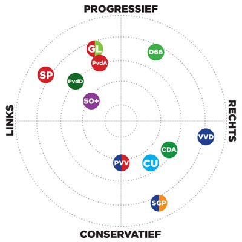

```{r setup, include=FALSE}
knitr::opts_chunk$set(echo = TRUE, tidy= TRUE, tidy.opts = list(comment = FALSE),
  dev.args = list(bg = 'transparent'),
  fig.align = "center"
  
)
library("tidyverse")
library("car")
library("ggplot2")
library("reshape2")
library("plyr")
library("GGally")
library("Hmisc")
library("lattice")
library("survival")
library("formatR")
```

# 1. Introduction 
In this report the election 

## 1.1 Summary data
In this chapter the data is summarized and explained how the data is collected. The percentage of votes per party per municipality were found on https://data.overheid.nl/data/dataset/verkiezingsuitslag-tweede-kamer-2017. The demographics; *amount of non-west residents per municipality*, *the urban index of a municipality* and *the standardized income per municipality*, were found on the CBS site. This is the Dutch central office of statistics.    

{width=250px}
**Dutch political parties**   
In this landscape the diffence between the parties is graphically displayed in this figure. In this research, two parties are chosen to investigate. These two parties had to be different, so that some comparisons could be made. The parties should not be to extreme left/right/conservative/progressive, so that the model will be proven to work on less-extreme parties. Therefore, the chosen parties are: CDA and GroenLinks. After the data-cleaning the CDA will be researched first, afterwards GroenLinks will be researched.  

**Demographics**  
In this research the above described demographics are chosen because of there influence on a municipality level. The thought is that a more non-western municipality for example votes different than a less non-western municipality. This is the same for the other two demographics. Other demographics are also researched, for example gender, but on a municipality level there is no big difference between the amount of men and women per municipality. So that is a more interesting demographic to research on an individual level. 
*The standardized income per municipality* are given in thousands. *the urban index of a municipality* is a database with five categories per municipality. These five categories are; really strong urban (more than 2500 addresses per km2), strong urban (1500-2500 addresses per km2), moderate urban (1000- 1500 addresses per km2), little urban (500-1000 addresses per km2) and not urban (less than 500 addresses per km2). Per municipality the amount of km2 per category is given. The *non-west residents per municipality* is given in an amount per municipality, also the total amount of residents is given per municipality. 

## 1.2 Data cleaning 
The variable *non-western residents* are divided in three groups. Municipalities with less than 5 % non-western residents, 5-10 % non-western residents and municipalities with more dan 10 % non-western residents.
```{r}
setwd("~/Studie/Statistics & Data Science/Semester 1/Lineair models and Algebra/CaseStudyLineair2018")
#GetData

Data <- read.csv("1_clean_data/voting_and_demographics.csv",
                 stringsAsFactors=F, header = T) 


#Remove and rename columns
Data <- Data[,-15]
colnames(Data) <- c("Muni", "VVD","CDA","PVV", "D66", "SP", "GL","PvdA","CU","50PLUS","PvdD","SGP","FvD","DENK", "Urban_index", "High_edu_perc", "Mean_income", "Dutch_perc", "West_perc", "Non_west_perc")

# Non_west_perc is not linear. Therefore, we create a dummy variable with 3 levels
# Level 1: x < 5%
# Level 2: 5 <= x < 10%
# Level 3: x >= 10%
Data$Non_west <- ifelse(Data$Non_west_perc < 0.05, 1, NA)
Data$Non_west <- ifelse(Data$Non_west_perc >= 0.05 
                        & Data$Non_west_perc < 0.1, 2, Data$Non_west)
Data$Non_west <- ifelse(Data$Non_west_perc >= 0.1, 3, Data$Non_west)

Data$Non_west <- as.factor(Data$Non_west)

# Select the right variables and remove NAs
Dat_cda <- Data[,c(1,3,15,16,17,21)]
Dat_cda <- Dat_cda[complete.cases(Dat_cda),]


```
## 1.3 Data visualisation
###CDA 
In this part the cleaned data is visualized, so that a good picture can be obtained of the current data. First of all some demographics of data will be showed. In these histograms the density of the *CDA*, *the urban index*, *the percentage of highly educated residents* and *the mean income* are plotted. 


```{r demographics_data, echo=FALSE, warning=FALSE,message=FALSE,error=FALSE}
#### Demographics of data ####

dens = ggplot(melt(Dat_cda), aes(x = value)) + 
  facet_wrap(~ variable, scales = "free", ncol = 2) + 
  geom_histogram(aes(y=..density..), position="identity", alpha=0.5)+
  geom_density(alpha=0.4, aes(fill = "red", col = "red"))+
  theme(legend.position="none")

plot(dens)
```

**Correlation heatmap**
In this heatmap the correlation between explanatory and respons variable are showed. The red color means a positive relation, the purple color means a negative relation. The relation between *mean income* and *percentage highly educated* is the highest. 

```{r correlation_heatmap, echo=FALSE, warning=FALSE,message=FALSE,error=FALSE}
#### Correlation ####
# Correlation and p-value matrices
corrlist <- rcorr(as.matrix(Dat_cda[,-1]), type="pearson")
pvalues = data.frame(corrlist[["P"]])
correlation = round(data.frame(corrlist[["r"]]), digits = 3)

# Heatmap of the correlations
heatmap = ggcorr(Dat_cda[-1], 
                 low = "darkblue", mid = "lightyellow", high = "red",
                 label = T, label_size = 2.5, label_round = 3,   
                 color = 'black', size = 4, layout.exp = 2, hjust = 1) +
  ggtitle('Correlation between explanatory & respons variables ')

plot(heatmap)
```


```{r boxplots_code, echo=FALSE, warning=FALSE,message=FALSE,error=FALSE}
#### Boxplots ####
fill <- "#4271AE"
line <- "#1F3552"

# Plot Probability CDA votes VS Non-western residents
p1 <- ggplot(Dat_cda[complete.cases(Dat_cda),], aes(x = Non_west, y = CDA)) + 
  geom_boxplot(outlier.colour="black", 
               outlier.size=2, 
               outlier.fill =  "red",
               na.rm = F,
               fill = fill,
               color = line) +
  ggtitle("Votes for CDA per municipality") +
  xlab("Percentage of non-western residents") +
  ylab("Probability") +
  scale_x_discrete(labels = c("< 5%", "5-10%", "> 10 %")) 

# Plot Urbanity index VS Non-western residents
p2 <- ggplot(Dat_cda[complete.cases(Dat_cda),], 
             aes(x = Non_west, y = Urban_index)) + 
  geom_boxplot(outlier.colour="black", 
               outlier.size=2, 
               outlier.fill =  "red",
               na.rm = F,
               fill = fill,
               color = line) +
  ggtitle("Urbanity index against non-western residents") +
  xlab("Percentage of non-western residents") +
  ylab("Urbanity index") +
  ylim(c(0,4)) +
  scale_x_discrete(labels = c("< 5%", "5-10%", "> 10 %")) 


#### Linear regression ####
rsq <- function (x, y) cor(x, y) ^ 2
rsq(Dat_cda$CDA, Dat_cda$Mean_income) # Calculate R-squared

# Linear regression between votes for CDA and mean income
Euro <- "\u20AC" # euro sign

p3 <- ggplot(Dat_cda, aes(x=Mean_income, y=CDA)) + 
  geom_point() + 
  geom_smooth(method=lm, se = T) + # standard error = True
  ggtitle("Probability of votes for CDA and mean income per municipality") +
  xlab(paste("Mean income per municipality (x ",Euro, " 1000)", sep = "")) +
  ylab("Probability of CDA votes") +
  xlim(c(20,42)) +
  annotate("rect", xmin = 35, xmax = 41, ymin = 0.32, ymax = 0.4, 
           fill="white", colour="red") +
  annotate("text", x=38, y=0.38, label = "correlation == -0.27", parse=T) + 
  annotate("text", x=38, y=0.35, label = "p-value < 0.001", parse=T)


p4 <- ggplot(Dat_cda, aes(x=Mean_income, y=High_edu_perc)) + 
  geom_point() + 
  geom_smooth(method=lm, se = T) + # standard error = True
  ggtitle("Highly educated residents and mean income per municipality ") +
  xlab(paste("Mean income per municipality (x ",Euro, " 1000)", sep = "")) +
  ylab("Probability of highly educated residents") +
  xlim(c(20,42)) +
  annotate("rect", xmin = 36.5, xmax = 42, ymin = 0.1, ymax = 0.18, 
           fill="white", colour="red") +
  annotate("text", x=39.5, y=0.16, label = "correlation == 0.567", parse=T) + 
  annotate("text", x=39.5, y=0.12, label = "p-value < 0.001", parse=T)


# Urbanity index and highly educated residents
p5 <- ggplot(Dat_cda, aes(x=Urban_index, y=High_edu_perc)) + 
  geom_point() + 
  geom_smooth(method=lm, se = T) + # standard error = True
  ggtitle("Highly educated residents and urbanity index") +
  xlab("Urbanity index") +
  ylab("Probability of highly educated residents") +
  xlim(c(0,4)) +
  ylim(c(0,0.5)) + 
  annotate("rect", xmin = 3.0, xmax = 4.0, ymin = 0.0, ymax = 0.1, 
           fill="white", colour="red") +
  annotate("text", x=3.5, y=0.08, label = "correlation == 0.397", parse=T) + 
  annotate("text", x=3.5, y=0.04, label = "p-value < 0.001", parse=T)


# Urbanity index and CDA votes
#cor.test(Dat_cda$CDA, Dat_cda$Urban_index) # get correlation and p-val
p6 <- ggplot(Dat_cda, aes(x=Urban_index, y=CDA)) + 
  geom_point() + 
  geom_smooth(method=lm, se = T) + # standard error = True
  ggtitle("Probability of the votes for CDA and urbanity index per municipality") +
  xlab("Urbanity index") +
  ylab("Probability votes CDA") +
  xlim(c(0,4.1)) +
  #ylim(c(0,0.5)) + 
  annotate("rect", xmin = 2.95, xmax = 4.05, ymin = 0.33, ymax = 0.4, 
           fill="white", colour="red") +
  annotate("text", x=3.5, y=0.38, label = "correlation == -0.587", parse=T) + 
  annotate("text", x=3.5, y=0.35, label = "p-value < 0.001", parse=T)


# Function to plot multiple plots together
multiplot <- function(..., plotlist=NULL, file, cols=2, layout=NULL) {
  library(grid)
  
  # Make a list from the ... arguments and plotlist
  plots <- c(list(...), plotlist)
  
  numPlots = length(plots)
  
  # If layout is NULL, then use 'cols' to determine layout
  if (is.null(layout)) {
    # Make the panel
    # ncol: Number of columns of plots
    # nrow: Number of rows needed, calculated from # of cols
    layout <- matrix(seq(1, cols * ceiling(numPlots/cols)),
                     ncol = cols, nrow = ceiling(numPlots/cols))
  }
  
  if (numPlots==1) {
    print(plots[[1]])
    
  } else {
    # Set up the page
    grid.newpage()
    pushViewport(viewport(layout = grid.layout(nrow(layout), ncol(layout))))
    
    # Make each plot, in the correct location
    for (i in 1:numPlots) {
      # Get the i,j matrix positions of the regions that contain this subplot
      matchidx <- as.data.frame(which(layout == i, arr.ind = TRUE))
      
      print(plots[[i]], vp = viewport(layout.pos.row = matchidx$row,
                                      layout.pos.col = matchidx$col))
    }
  }
}
```
**multiplot**
```{r multi_plots, echo=FALSE, warning=FALSE,message=FALSE,error=FALSE}
multi_linear <- multiplot(p3, p6, p5, p4)

```
**boxplots**
```{r multi_boxplots, echo=FALSE, warning=FALSE,message=FALSE,error=FALSE, height=6}
multi_boxpl <- multiplot(p1, p2)

```
### Groenlinks  


# 2. Formulate model 
Model formuleren

## CDA 
```{r set_up_CDA, echo=FALSE, warning=FALSE,message=FALSE,error=FALSE}
#### Libraries ####
library(car)


#### Set up ####
rm(list = ls()) # empty work space
Data <- read.csv("1_clean_data/Cleandata_CDA_2018-12-06.csv", 
                 header = T, stringsAsFactors = F)

Data$Non_west <- as.factor(Data$Non_west) # needs to be recognized as factor

```

## GroenLinks


# 3 Final model
## CDA 

## Groenlinks 

# 4 Analyse output 

# 5 Discussion

## 5.1 Limitations 